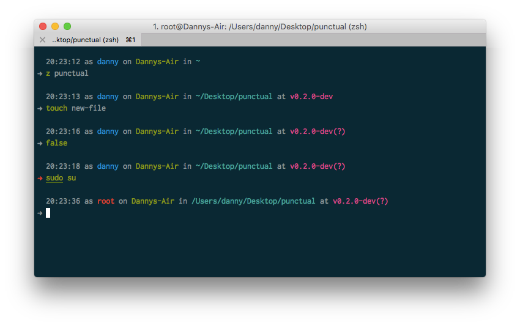

# Punctual, a Zsh prompt theme



Add a bit of flavour to your prompt! My personal Zsh prompt theme, influenced heavily by [denysdovhan](https://github.com/denysdovhan)'s [Spaceship theme](https://github.com/denysdovhan/spaceship-zsh-theme).


## Features

* Customisable colours & output
* Git branch & status display
* Username turns red when root
* Prompt turns red if the last command finishes with non-zero exit code


## Installation

In the screenshot above I'm using [Solarized colours](https://github.com/altercation/solarized/tree/master/iterm2-colors-solarized) for [iTerm2](https://www.iterm2.com/), along with the [Inconsolata font](https://www.google.com/fonts/specimen/Inconsolata).

### Oh My Zsh

1. Download [punctual.zsh-theme](https://raw.githubusercontent.com/dannynimmo/punctual-zsh-theme/v0.1.0/punctual.zsh-theme) into your custom theme directory, `$ZSH_CUSTOM/themes`
2. Update `ZSH_THEME="punctual"` in your `~/.zshrc`
3. Open a new terminal to see the theme

### Antigen
Include the following line to `~/.zshrc` as part of your antigen setup (after any [configuration settings](#configuration)).
```zsh
antigen theme dannynimmo/punctual-zsh-theme punctual
```


## Configuration

By setting variables before loading the theme, you can customise the output format of Punctual.

### Hiding parts

Set any of the following variables to `"false"` to hide the output.

```zsh
PUNCTUAL_SHOW_BLANK_LINE="false";
PUNCTUAL_SHOW_TIMESTAMP="false";
PUNCTUAL_SHOW_USER="false";
PUNCTUAL_SHOW_HOSTNAME="false";
PUNCTUAL_SHOW_CURRENT_DIR="false";
PUNCTUAL_SHOW_GIT="false";
```

### Colours

Set any of the following variables to one of the 8 ANSI colour names.

```zsh
PUNCTUAL_TIMESTAMP_COLOUR="red";
PUNCTUAL_USER_COLOUR="green";
PUNCTUAL_ROOT_USER_COLOUR="yellow";
PUNCTUAL_HOSTNAME_COLOUR="blue";
PUNCTUAL_CURRENT_DIR_COLOUR="magenta";
PUNCTUAL_GIT_COLOUR="cyan";
```

Possible values are:

* `black`
* `red`
* `green`
* `yellow`
* `blue`
* `magenta`
* `cyan`
* `white`

### Bold fonts

Set any of the following variables to `"true"` to use the terminal's bold font.

```zsh
PUNCTUAL_TIMESTAMP_BOLD="true";
PUNCTUAL_USER_BOLD="true";
PUNCTUAL_ROOT_USER_BOLD="true";
PUNCTUAL_HOSTNAME_BOLD="true";
PUNCTUAL_CURRENT_DIR_BOLD="true";
PUNCTUAL_GIT_BOLD="true";
```

### Timestamp format

Set the below variable to customise the timestamp format. See [`man strftime`](http://man7.org/linux/man-pages/man3/strftime.3.html) for format options.

```zsh
PUNCTUAL_TIMESTAMP_FORMAT="%l:%M%P";
```

### Prompt symbol

Set the below variable to your favourite prompt symbol (or emoji 😅).

```zsh
PUNCTUAL_PROMPT="$";
```

### Git status symbols

If you already have your `ZSH_THEME_GIT_PROMPT_*` variables set, Punctual will respect those. Alternatively, set the following variables to customise the Git status symbols.

```zsh
PUNCTUAL_GIT_SYMBOL_UNTRACKED="?";
PUNCTUAL_GIT_SYMBOL_ADDED="+";
PUNCTUAL_GIT_SYMBOL_MODIFIED="!";
PUNCTUAL_GIT_SYMBOL_RENAMED="!";
PUNCTUAL_GIT_SYMBOL_DELETED="!";
PUNCTUAL_GIT_SYMBOL_STASHED="*";
PUNCTUAL_GIT_SYMBOL_UNMERGED="M";
PUNCTUAL_GIT_SYMBOL_AHEAD="↑";
PUNCTUAL_GIT_SYMBOL_BEHIND="↓";
PUNCTUAL_GIT_SYMBOL_DIVERGED="~";
```


## Changelog

### [0.2.0](https://github.com/dannynimmo/punctual-zsh-theme/releases/tag/v0.2.0) — 2016-09-16
* Added ability to use bold fonts

### [0.1.0](https://github.com/dannynimmo/punctual-zsh-theme/releases/tag/v0.1.0) — 2016-08-01
* Released!
